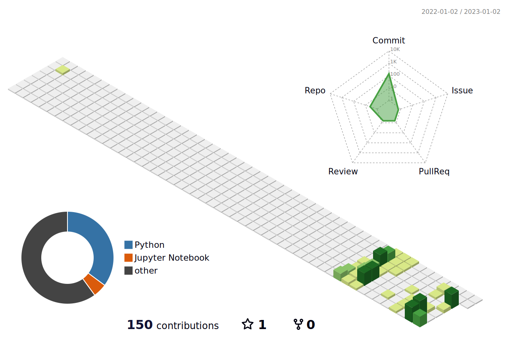

<!--greating-->

<!-- widget box  -->

 
 

 

 
 

<!-- Icon and social links -->

  

<h3 align="center">Developer | Hobby Artist | Student </h3>
  

 

  <a href=""></a>
  <a href=""></a>
  <a href=""></a>

 
 

<!--git status-->

  
  

&nbsp;
&nbsp;

 

 
 

  
  

  
  

 
 

&nbsp;
&nbsp;

&nbsp;
&nbsp;
<!-- -->

<!-- old_code-->

<!-- https://i.pinimg.com/750x/9b/4e/c7/9b4ec7ba0fc7e217d8f0f0675038c6d7.jpg -->
<!-- https://i.pinimg.com/750x/9e/9c/ad/9e9cad53d3eddc421a2ac0a6cf2e3948.jpg -->

<!-- 
 
-->

<!-- <table class="images" width="100%"  style="border:0px solid white; width:100%;">
    <tr style="border: 0px;">
        <td width="33%" style="border:0px; width:33.33%">
            
        </td>
        <td width="33%" style="border:0px; width:33.33%">
            
        </td>
        <td width="33%" style="border:0px; width:33.33%">
            
        </td>
    </tr>
</table> -->

<!--

-->

<!--

              	       
 
 

-->

<!--

-->

<!--

-->

<!--

<table cellpadding="0">
  <tr style="padding: 0"> 
    <td valign="top"> </td>
    <td valign="top"></td>
  </tr>
</table>

-->
