 

 

<!--api status-->

 
&nbsp;&nbsp;&nbsp;**REPO_PH** **Repositories** &nbsp;&nbsp;&nbsp;&nbsp;**FOLLOW** **Followers**&nbsp;&nbsp;&nbsp;&nbsp;**COMMITS** **Commits**
 
 
&nbsp;&nbsp;
&nbsp;
&nbsp;
<!-- <a href=""></a>
<a href=""></a>
<a href=""></a> -->

 

 

<h5>@𝗚𝗿𝗲𝗺𝗺𝘆</h5>
<h6><i>Developer</i> | <i>Hobby Artist</i> | <i>Student</i></h6>
<h6>Passionate about learning, coding, and artistry—always exploring, tinkering, and creating.</h6>
<h6>𝗖𝘂𝗿𝗿𝗲𝗻𝘁𝗹𝘆 𝗗𝗲𝘃𝗲𝗹𝗼𝗽𝗶𝗻𝗴: Building services with <a href="https://grpc.io/">gRPC</a></h6>

 
 

&nbsp;
&nbsp;
&nbsp;

&nbsp;
&nbsp;
&nbsp;

&nbsp;
&nbsp;
&nbsp;

&nbsp;
&nbsp;
&nbsp;

&nbsp;
&nbsp;
&nbsp;

 
 

&nbsp;
&nbsp;

&nbsp;
&nbsp;

&nbsp;
&nbsp;

&nbsp;
&nbsp;

 
 

  
 
&nbsp;
&nbsp;

 
 

&nbsp;
&nbsp;
&nbsp;

 
 

## 🧑‍🎨 Art Gallery
 

<!--  -->
<!--  -->

