 

 

<!--api status-->

 
&nbsp;&nbsp;&nbsp;**REPO_PH** **Repositories** &nbsp;&nbsp;&nbsp;&nbsp;**FOLLOW** **Followers**&nbsp;&nbsp;&nbsp;&nbsp;**COMMITS** **Commits**
 
 
&nbsp;&nbsp;
&nbsp;
&nbsp;
<!-- <a href=""></a>
<a href=""></a>
<a href=""></a> -->

 

 

<h5>@𝗚𝗿𝗲𝗺𝗺𝘆</h5> 
<h6>𝗗𝗲𝘃𝗲𝗹𝗼𝗽𝗲𝗿  | 𝗛𝗼𝗯𝗯𝘆 𝗔𝗿𝘁𝗶𝘀𝘁 [3𝗗] | 𝗦𝘁𝘂𝗱𝗲𝗻𝘁</h6>
<h6>Passionate about learning, coding, and artistry—always exploring, tinkering, and creating.</h6>
<h6>𝗖𝘂𝗿𝗿𝗲𝗻𝘁𝗹𝘆 𝗗𝗲𝘃𝗲𝗹𝗼𝗽𝗶𝗻𝗴: 👨‍🚀 Building services with <a href="https://grpc.io/">gRPC</a></h6>
<h6><i>🟥𝖻𝖾𝗌𝗍 𝗏𝗂𝖾𝗐𝖾𝖽 𝗂𝗇 𝗅𝗂𝗀𝗁𝗍 𝗍𝗁𝖾𝗆𝖾</i></h6> 

 
 

 
&nbsp;
&nbsp;
&nbsp;

&nbsp;
&nbsp;
&nbsp;

&nbsp;
&nbsp;
&nbsp;

&nbsp;
&nbsp;
&nbsp;

&nbsp;
&nbsp;
&nbsp;

 
 

&nbsp;
&nbsp;

&nbsp;
&nbsp;

&nbsp;
&nbsp;

&nbsp;
&nbsp;

 
 

  
 
&nbsp;
&nbsp;

 
 

 
&nbsp;
&nbsp;
&nbsp;

 
 

## 🧑‍🎨 Art Gallery
 

<!--  -->
<!--  -->

<!--

<h3 align="left">Languages and Tools:</h3>

 

 

  
  
  
 
  
  
 
  
  
 
  
  
   
  
  
  
  
 
  
  
 
 
  
 
 
  
  
 
 
 
 
  
 
 

